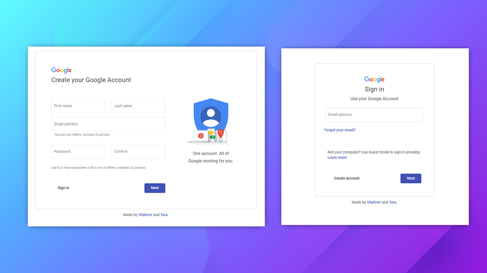

# My Google Service - Full Stack Graduate Project
 


[](https://my-google-service-api.herokuapp.com/)
[](https://my-google-service.herokuapp.com/)

Full stack graduate project made using **Spring Boot** and **Angular**. The application features simplified remakes of the Google's services for contacts and photos, as well as the login/registration process. Project's main goal is to, in its respectable separate halves, display a complete process of creating a full-stack application. However, Google's services were used as loose guidelines for both the UI design, and the functionalities.

## Starting the Application

### Heroku

Please make sure to run the backend before using the frontend application!

Backend: [](https://my-google-service-api.herokuapp.com/)

Frontend: [](https://my-google-service.herokuapp.com/)

## Testing Accounts' Info

```
Email: zack@gmail.com
Password: 123
```

## Authors

► [Tara Pogančev](https://github.com/tara-pogancev/) (Google Contacts)

► [Vladimir Rokvić ](https://github.com/vladimirr9/)  (Google Photos)

## Resources

- [Google Fonts](https://fonts.google.com/)
- [Shields IO](https://shields.io/)
- [Angular Material](https://material.angular.io/)
- [Bulma](https://bulma.io/)

## Screenshots




